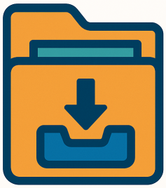

<h1>
  
  Yuno Archive
</h1>

A Bash script to back up directories and send them to a selected repository using `local`, custom mount points (`drive`), or any backend supported by `rclone`. Originally built for YunoHost backups, but works on any Linux environment.


## 🧰 Features

- Create `.tar` archives from any directory or file
- Compress archives (`gzip`, `bzip2`, `xz`)
- Send to local folders, mounted drives, or any `rclone` destination
- Attach additional metadata files
- Restore and delete backups easily
- Modular design: add your own methods

## ⚙️ Usage

```bash
yuno-archive.sh <Action> <Method> [Action options] [Method options]
```

### Actions

- `backup` – Archive a directory and send it to a repo
- `delete` – Remove a backup from a repo
- `help` – Show help message (or help <Method> for method-specific help)
- `list` – List available backups
- `restore` – Restore a backup

### Methods

- `local` – Save to a local folder
- `drive` – Save to a mounted volume (external or internal drive)
- `rclone` – Use any backend supported by rclone (e.g. Dropbox, OneDrive, S3...)

### General Options

Option|Description
------|-----------
`-l`, `--log=<log file>`|Log messages to a file|
`-q`, `--quiet`|Do not print messages to stdout/stderr
`-v`, `--verbose`|Enable detailed output

### Backup Options

Option|Description
------|-----------
`-c`, `--compress=<type>`|Compression type: `gzip`, `bzip2`, `xz`
`-i`, `--info=<file>`|Attach additional file(s) (space-separated)
`-n`, `--name=<archive name>`|Archive name (default: current datetime)
`-s`, `--source=<dir>`|**(Required)** Source directory or files to back up
`-k`, `--keep=<number>`|How many backups to keep (default: all). Set value to `all` if you don't want to delete any old archive.

### List Options

Option|Description
------|-----------
`-s`, `--sort=<order>`|Sort order: `olderfirst` / `o`, `newerfirst` / `n`

### Restore Options
Option|Description
------|-----------
`-d`, `--destination=<dir>`|**(Required)** Directory to restore backup into
`-n`, `--name=<archive name>`|**(Required)** Name of the archive to restore

### Example Usage

Backup /etc/yunohost to a mounted drive with gzip compression:
```bash
./yuno-archive.sh backup drive -source="/etc/yunohost" --compress gzip -n etc_backup
```
List local backups, newest first:
```bash
./yuno-archive.sh list local -s newerfirst
```
Restore a backup from rclone to /tmp/restore:
```bash
./yuno-archive.sh restore rclone -n etc_backup -d /tmp/restore
```

## 🧩 Extend with custom methods

To support additional storage backends (e.g. FTP, WebDAV), create a new file in methods/ named:
```
methods/<your_method_name>_method.sh
```
Your method script must implement these functions:
```bash
init_method             # Initialize and validate method configuration
get_available_space     # Return available space (in bytes)
list_archives           # List all available archives
count_archives          # Count the number of backups
send_to_dest            # Send archive to destination
delete_archive          # Delete archive by name
cleanup_method          # Cleanup after operations
usage_method            # Print method-specific help
fetch_from_dest         # Retrieve archive from destination
```
If any function is missing, the script will abort with an error.

You can use local_method.sh or rclone_method.sh as templates.

## Credits

Made with love for the YunoHost community ❤️
