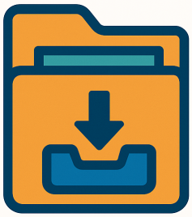

<h1>
  
  Yuno Archive
</h1>

A Bash script to back up directories and send them to a selected repository using `local`, custom mount points (`drive`), or any backend supported by `rclone`. Originally built for YunoHost backups, but works on any Linux environment.


## 🧰 Features

- Create `.tar` archives from any directory or file
- Compress archives (`gzip`, `bzip2`, `xz`)
- Send to local folders, mounted drives, or any `rclone` destination
- Attach additional metadata files
- Restore and delete backups easily
- Modular design: add your own methods

## ⚙️ Usage

```bash
yuno-archive.sh <Action> <Method> [Action options] [Method options]
```

### Actions

- `backup` – Archive a directory and send it to a repo
- `delete` – Remove a backup from a repo
- `help` – Show help message (or help &lt;Method&gt; for method-specific help)
- `info` – Get archive details infos
- `list` – List available backups
- `send` - Send archive from a local dir to a remote repo (send as much as possible and delete old remote archives if necessary)
- `restore` – Restore a backup
- `version` – Show script version

### Methods

- `local` – Save to a local folder
- `drive` – Save to a mounted volume (external or internal drive)
- `rclone` – Use any backend supported by rclone (e.g. Dropbox, OneDrive, S3...)
- `scp` – Use scp command to send archives (copy throught SSH protocol)

### General Options

Option|Description
------|-----------
`-l`, `--log=<log file>`|Log messages to a file|
`-q`, `--quiet`|Do not print messages to stdout/stderr
`-v`, `--verbose`|Enable detailed output

### Backup Options

Option|Description
------|-----------
`-c`, `--compress=<type>`| Compression type: `gzip`, `bzip2`, `xz` (if type not set, use gzip)
`-C`, `--check_size` | Check if there is enough space in temp dir to create archive (compare source size to available space in root temp dir)
`-i`, `--info=<file>`| Attach additional file(s) (space-separated)
`-m`, `--min=<number>`| Minimum number of existing backups to keep when pruning due to lack of space (default: `all`)
`-M`, `--max=<number>`| Maximum number of backups to keep. If exceeded, older archives are deleted (default: `all`, minimum value: `1`)
`-n`, `--name=<archive name>`| Archive name (default: current datetime)
`-s`, `--source=<dir>`| **(Required)** Source directory or files to back up

### List Options

Option|Description
------|-----------
`-s`, `--sort=<order>`|Sort order: `olderfirst` / `o`, `newerfirst` / `n`
`-f`, `--full` | Print result as table with size and date
`-h`, `--human_readable` | *(only with --full option)* Print size and date as human readable

### Restore Options
Option|Description
------|-----------
`-D`, `--destination=<dir>`|**(Required)** Directory to restore backup into
`-n`, `--name=<archive name>`|**(Required)** Name of the archive to restore


### Send Options
Option|Description
------|-----------
`-s`, `--source=<dir>`| **(Required)** Source directory or files to back up


### Methods Options

For each method, you need to add thoses options.

#### Local method

Option|Description
------|-----------
`-r`, `--repository=<destination repository>`| **(Required)** Directory to store files

#### Drive method

Option|Description
------|-----------
`-d`, `--drive=<destination drive>` | **(Required)** Drive (partition) to store archives (ex: /dev/sdc1)
`-r`, `--repository=<subdir>`| Subdirectory of the disk to use for storing the archives (default: backups)

#### Rclone method

Option|Description
------|-----------
`-r`, `--repository=<rclone repository>`| **(Required)** Rclone repository without ':' at the end
`-p`, `--path=<path>`| Directory in rclone repository (default: /)

#### SCP method

Option|Description
------|-----------
`-p`, `--port=<port>`| Define port number for ssh connection (default: 22)
`-r`, `--repository=<destination repository>`| **(Required)** repository in the format `[user@]host:/absolute/directory/path`


### Example Usage

Backup /etc/yunohost to sdg2 drive on subdir /etc_backup with gzip compression:
```bash
./yuno-archive.sh backup drive --source="/etc/yunohost" --compress gzip -r etc_backup -d /dev/sdg2
```
List local backups, newest first:
```bash
./yuno-archive.sh list local -s newerfirst
```
Restore a backup from rclone to /tmp/restore:
```bash
./yuno-archive.sh restore rclone -n etc_backup -d /tmp/restore
```

Create an incremental backup with base name "data" throught scp
```bash
./yuno-archive.sh backup scp -n data -s "/home/data" --incremental -r "backup@192.168.1.12:/home/backups"
```

Delete a backup name "data" and all increments stores in a scp repo
```bash
./yuno-archive.sh delete scp -n data -r "backup@192.168.1.12:/home/backups"
```

## Contribute

Just create pull request on develop branch.

### 🧩 Extend with custom methods

To support additional storage backends (e.g. FTP, WebDAV), create a new file in methods/ named:
```
methods/<your_method_name>_method.sh
```
Your method script must implement these functions:
```bash
init_method             # Initialize and validate method configuration
get_available_space     # Return available space (in bytes)
list_archives           # List all available archives
count_archives          # Count the number of backups
send_to_dest            # Send archive to destination
delete_archive          # Delete archive by name
cleanup_method          # Cleanup after operations
usage_method            # Print method-specific help
fetch_from_dest         # Retrieve archive from destination
fetch_archive_snapshot  # Copy snapshot file to a destination
```
If any function is missing, the script will abort with an error.

You can use local_method.sh or rclone_method.sh as templates.

## Credits

Made with love for the YunoHost community ❤️
